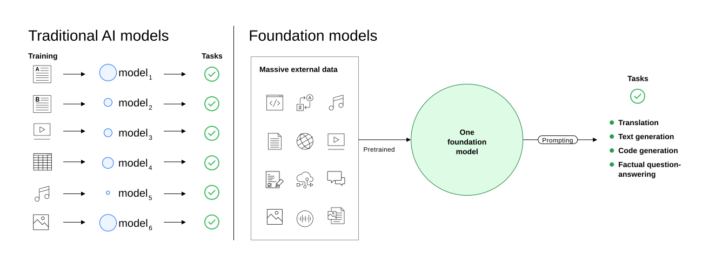

# Foundation model architecture

Source: https://www.ibm.com/docs/en/watsonx/saas?topic=solutions-developing-generative-ai-foundation-models#foundation-model-architecture

Foundation models are large AI models that have billions of parameters and are trained on terabytes of data. Foundation models can do various tasks, including text, code, or image generation, classification, conversation, and more. Large language models are a subset of foundation models that can do tasks that are related to text and code.

Foundation models represent a fundamentally different model architecture and purpose for AI systems. The following diagram illustrates the difference between traditional machine learning AI models and foundation models for generative AI.

As shown in the diagram, traditional AI models specialize in specific tasks. Most traditional AI models are built by using machine learning, which requires a large, structured, well-labeled data set that encompasses a specific task that you want to tackle. Often these datasets must be sourced, curated, and labeled by hand, a job that requires people with domain knowledge and takes time. After it is trained, a traditional AI model can do a single task well. The traditional AI model uses what it learns from patterns in the training data to predict outcomes in unknown data. You can create machine learning models for your specific use cases with tools like AutoAI and Jupyter notebooks, and then deploy them.

In contrast, foundation models are trained on large, diverse, unlabeled datasets and can be used for many different tasks. Foundation models were first used to generate text by calculating the most-probable next word in natural language translation tasks. However, model providers are learning that, when prompted with the right input, foundation models can do various other tasks well. Instead of creating your own foundation models, you use existing deployed models and engineer prompts to generate the results that you need.
